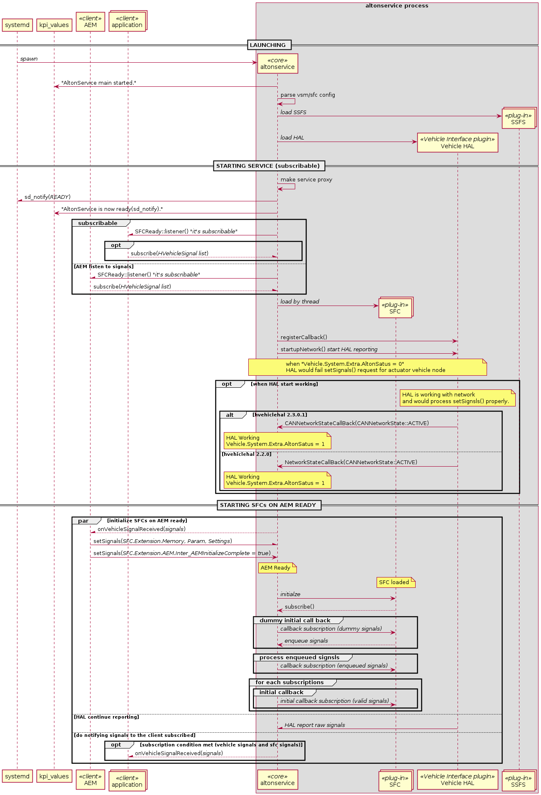

# Index

<b>1. [Precondition to start SFC](#1-precondition-to-start-sfc)</b>
<b>2. [Extension Node](#2-extension-node)</b>
   <b>2.1. [Used by SFC and Application](#21-used-by-sfc-and-application)</b>
   <b>2.2. [Used by Only Application](#22-used-by-only-application)</b>
<b>3. [SFC modules not provided](#3-sfc-modules-not-provided)</b>

---

 본 문서는 SFC를 사용하는 Application(ex HMI) 개발 가이드로 SFC가 동작하기 위한 조건 및 Application에서 관리해야 하는 노드의 정보를 제공한다.

# 1. Precondition to start SFC

 하기 다이어그램은 Altonservice 부팅 후의 시퀀스 다이어그램이며, Altonservice는 AEM으로 부터 Inter_AEMinitializeComplete 신호를 True로 수신한 후, SFC 초기화 및 데이터 전송을 시작한다.

 

# 2. Extension Node

 본 장은 SFC와 Application에서 사용하는 Extension Node에 대한 정보를 기술한다.

 모든 Node는 SFC에 의해 생성이 되나, SFC에서 참조하지 않고 Application에서 Node 값의 초기화, 업데이트, 참조하는 항목을 구별하기 위해 기술한다.

- <b>Used by SFC and Application</b>
  - SFC 와 Application에서 모두 참조 하는 항목이다.

- <b>Used by Only Application</b>
  - Application에서만 참조하는 항목이다.
  - Application에서 Node 값의 초기화 및 관리를 해야 하는 항목이다.

 

